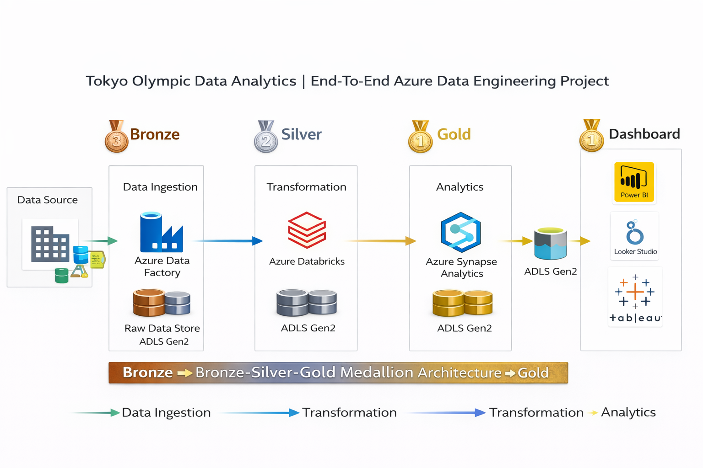

# 🏅 Tokyo Olympic Data Engineering Pipeline (Azure Medallion Architecture)

An end-to-end **Azure-based data engineering pipeline** built to process and analyze structured Tokyo Olympics datasets using the **Bronze–Silver–Gold Medallion Architecture** for scalable, analytics-ready data.

This project demonstrates how raw sports data can be transformed into **BI-ready insights** using modern cloud data engineering tools.

---
## 🏗 Architecture Diagram

## 🚀 Project Overview

This pipeline ingests multiple structured Olympic datasets and processes them through layered transformations to produce **curated analytics datasets** for reporting and insights.

**Key focus areas:**
- Scalable data lake architecture  
- PySpark-based transformations  
- Dimensional modeling  
- Gold-layer analytical aggregations  

---

## 🧱 Architecture — Medallion Design

| Layer | Purpose | Tools Used |
|------|---------|------------|
| 🥉 **Bronze** | Raw data ingestion & storage | ADLS Gen2 |
| 🥈 **Silver** | Data cleansing, deduplication, enrichment | Azure Databricks, PySpark |
| 🥇 **Gold** | Aggregations & BI-ready tables | Synapse Analytics, Power BI |

**Flow:**  
`Raw Data → Bronze → Silver → Gold → Analytics`

---

## 📥 Datasets Used

Structured Olympic datasets processed:

- Athletes  
- Coaches  
- Teams  
- Medals  
- Gender Participation  

---

## 🥉 Bronze Layer — Raw Data Storage

**Goal:** Store source data in its original form.

- Data ingested into **Azure Data Lake Storage Gen2**
- Maintains:
  - Historical data  
  - Schema preservation  
  - Source traceability  

---

## 🥈 Silver Layer — Data Transformation

**Goal:** Create clean, structured, analytics-ready datasets.

Processed using **Azure Databricks + PySpark**

### Transformations performed:
- Data cleansing  
- Deduplication  
- Standardization  
- Schema alignment  
- Enrichment across datasets  

### Data modeling:
- Designed **Fact tables**
- Designed **Dimension tables**

**Example:**
- Fact: Medal Results  
- Dimensions: Athlete, Country, Event, Gender  

---

## 🥇 Gold Layer — Analytics & Aggregations

**Goal:** Provide optimized datasets for reporting and BI.

Built using **Synapse Analytics**

### Gold-layer outputs:
- 🥇 Medal leaderboards by country  
- 👥 Athlete participation metrics  
- ⚖️ Gender participation ratios  
- 🏆 Performance trend summaries  

These tables are:
- Aggregated  
- Query-optimized  
- BI-consumption ready  

---

## 📊 Analytics Layer

Gold datasets are consumed in:

- **Power BI Dashboards**
- Synapse SQL queries
- Business intelligence reporting

---

## 🛠 Tech Stack

| Category | Tools |
|----------|------|
| Storage | Azure Data Lake Storage Gen2 |
| Processing | Azure Databricks, PySpark |
| Data Modeling | Fact & Dimension Design |
| Warehouse / Query | Azure Synapse Analytics |
| Visualization | Power BI |

---

## 💡 Key Data Engineering Concepts Demonstrated

- Medallion Architecture  
- Cloud Data Lake Design  
- PySpark ETL Processing  
- Dimensional Modeling  
- Scalable Data Pipelines  
- BI Data Optimization  

---

## 📈 Business Value

This pipeline converts raw Olympic datasets into:

✔ Structured analytics models  
✔ Performance insights  
✔ Participation analysis  
✔ BI-ready dashboards  

---

## 🧠 What This Project Shows

This is not just a notebook project — it demonstrates:

- Production-style data layering  
- Enterprise ETL design  
- Cloud-native data engineering  
- End-to-end analytics pipeline design  
